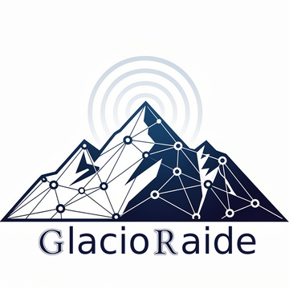

  
  
  
  

  

  

<h2> 
Projet interdisciplinaire pour l'instrumentation et l'étude des glaciers suspendus et tabliers de glace.  
Collaboration entre <a href="https://edytem.osug.fr/" target="_blank">EDYTEM</a> et le <a href="https://www.lapp.in2p3.fr/" target="_blank">LAPP</a>.
</h2>

